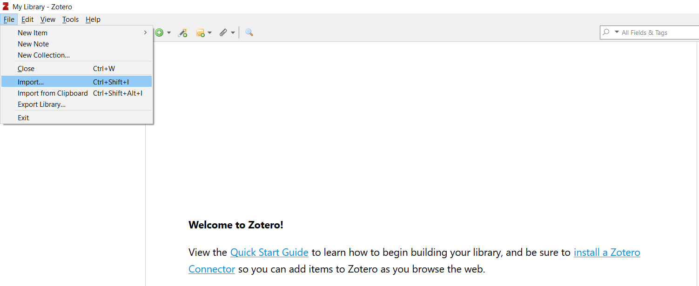
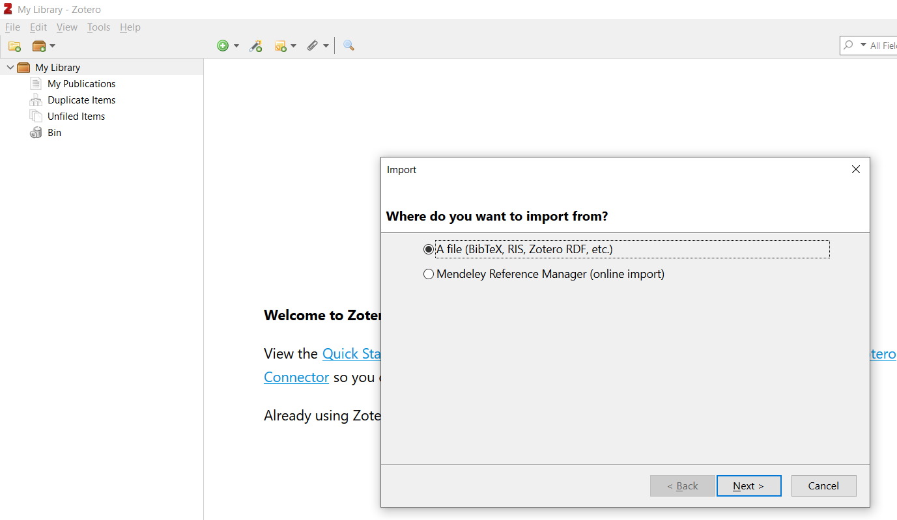
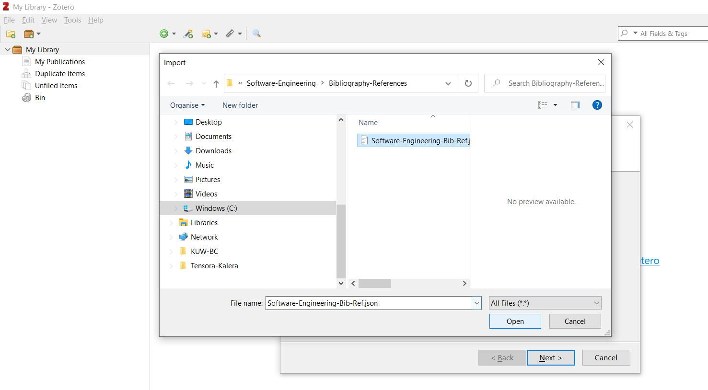
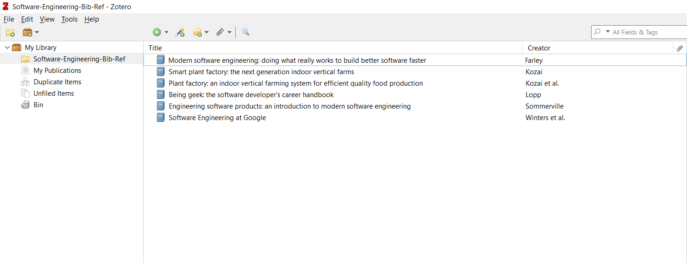

# Zotero als unser Software Engineering Research Tool

## Getting started

1. Installiere Zotero:
[:link: Wähle den entsprechenden Download für Dein Betriebssysstem](https://www.zotero.org/) 

2. Lade die Bibliographie für unser Projekt zu Testzwecken herunter:
[:link: Copy & Paste in eine Datei mit der Endung -json und speichern.](https://github.com/oliverhankel/Software-Engineering/blob/main/Bibliography-References/Software-Engineering-Bib-Ref.json) 
> Im weiteren Verlauf unseres Kurses werden wir den Umgang mit Git lernen, sobald dieser Prozess aufgesetzt ist, wird dieser Schritt nicht mehr notwendig sein.

3. Importiere die Bibliographie in Zotero:

3.1. Import wählen:

3.2. Bibtex Format auswählen

3.3. Datei auswählen:

3.4. Neue Kollektion starten und Referenz auf die lokale Datei beibehalten:

3.5. So sollte der erste Import aussehen:

## Neue Einträge hinzufügen 

## Mehr Dokumentation

[:link: Für weitere Informationen und Inspirationen bitte die Dokumentation von Zotero konsultieren](https://www.zotero.org/support/)