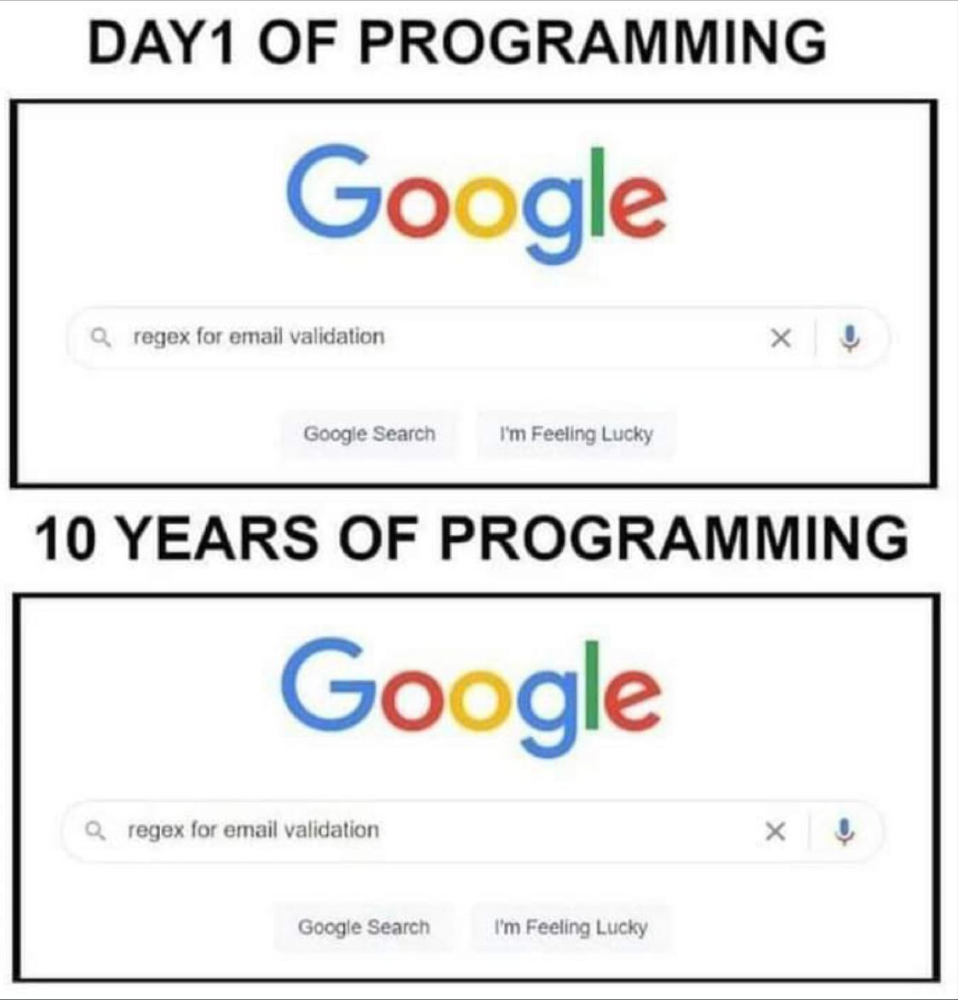

# Eine gesunde Umgebung

## Übung 1: Träume und Alpträume / Wünsche
Nimm Dir **10 Minuten** Zeit und denke darüber nach, welcher Traum /Wunsch oder welcher Alptraum verhindert (oder verhindern könnte), dass Du zu einem frühem Zeipunkt, Ergebnisse Deiner Arbeit präsentierst.

Schreib es auf einen Zettel!

## Übung 2: Bespreche mit einem Partner die Ergebnisse
- Suche Dir einen Partner
- Bespreche mit Deinem Partner, wie die Ergebnisse aus Übung 1 Deine tägliche Arbeit beeinflussen könnte.
- Wer mag berichten?

## Lose your ego!

Found here: https://9gag.com/gag/aYoLPrV

> And to succeed on an engineering team—or in any other creative collaboration—you need to reorganize your behaviors around the core principles of humility, respect, and trust. [^1]

Grundsätzlich gilt: Sei keine Diva! So viele Snickers kann sich keiner leisten.
(Software) Engineering ist ein Teamsport!

-- Schaut Euch Richard Hamming Sessions an :-)

### Soziale Interaktion

Folgende Eigenschaften und Verhaltensweisen muss jedes Teammitglied mitbringen:

1.  Demut
Sie sind nicht das Zentrum des Universums (und Ihr Code auch nicht!). Sie sind weder allwissend noch unfehlbar. Sie sind offen für Selbstverbesserung.

2.  Respekt
Die Menschen, mit denen Sie zusammenarbeiten, sind Ihnen wirklich wichtig. Sie behandeln sie freundlich und schätzen ihre Fähigkeiten und Leistungen.

3. Vertrauen
Sie glauben, dass andere kompetent sind und das Richtige tun werden, und es ist für Sie in Ordnung, sie fahren zu lassen, wenn es angebracht ist.

Bei einer Betrachtung von fehlgeschlagener Kommunikation, fehlgeschlagenen Projekten und verfehlten Zielen, dann kommt bei einer Ursachenanalyse darauf, dass im Umgang miteinander, diese oben genannten Aspekte der sozialen Interaktion nicht eingehalten worden sind.[^3]

Ohne eine gelungene soziale Interaktion, wird es keine gesunde Arbeitsumgebung, in der man sich wohlfühlt, geben. 
Keine Sicherheit an der Arbeit bedeutet kein **Fun**. 
> If it is no fun, we are doing something wrong.

Folgender Text kann zur Vertiefung gelesen werden:

*Learning from the Past to Face the Risks of Today*:

> The goal was not to blame people for mistakes but instead to blame the process.[^2]

Folgendes Buch stellt eine wunderbare Zusammenfassung dar, wie man frühzeitig erkennt, wer dazu beiträgt, dass man sich in Unternehmen oder in seiner Arbeitsumgebung nicht sicher fühlt:

*Der Arschloch-Faktor* von Robert I. Sutton[^4]

[^1]: [[@http___zotero.org_users_local_ZrCg5Awg_items_6XJEYKSR]]
[^2]: [[@http___zotero.org_users_local_ZrCg5Awg_items_E26NPHBW]]
[^3]: [[@http___zotero.org_users_local_ZrCg5Awg_items_6XJEYKSR]]
[^4]: [[@http___zotero.org_users_local_ZrCg5Awg_items_9LG347E7]]