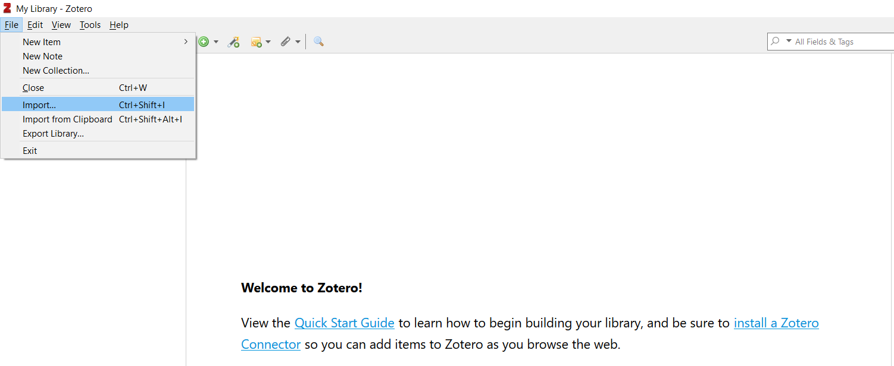
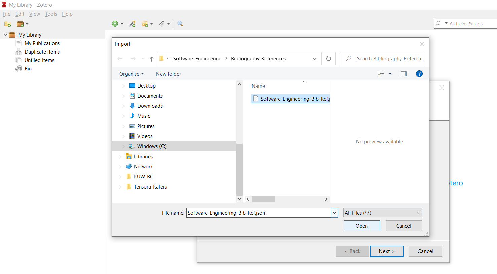
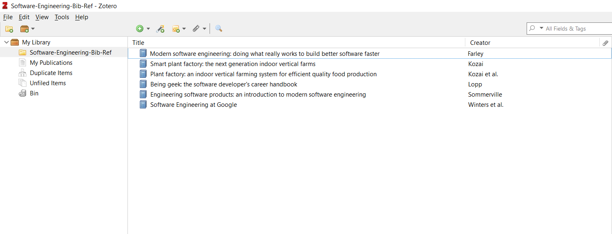

# Zotero als unser Software Engineering Research Tool

## Getting started

Installiere Zotero:
[:link: Wähle den entsprechenden Download für Dein Betriebssysstem](https://www.zotero.org/) 

Lade die Bibliographie für unser Projekt zu Testzwecken herunter:
[:link: Copy & Paste in eine Datei mit der Endung -json und speichern.](https://github.com/oliverhankel/Software-Engineering/blob/main/Bibliography-References/Software-Engineering-Bib-Ref.json)

Im weiteren Verlauf unseres Kurses werden wir den Umgang mit Git lernen, sobald dieser Prozess aufgesetzt ist, wird dieser Schritt nicht mehr notwendig sein.

Importiere die Bibliogrpahie in Zotero:

##  