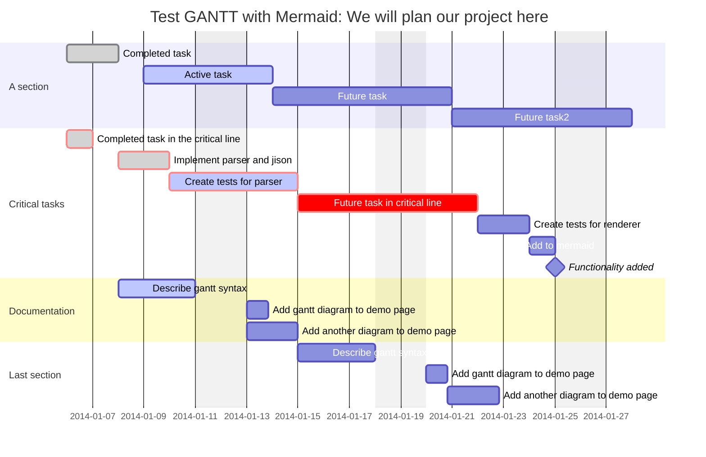

# Einführung in Software Engineering (für Interessierte)

Im Rahmen einer Wahlpflichtveranstaltung stelle ich auf Github die Unterrichtsmaterialien sowie die teilweise die Unterrichtsmethodik zur Verfügung.

Folgende Tools sind verwendet worden:

- [Git](https://git-scm.com/)
- [Visual Studio Code](https://code.visualstudio.com/)
- [Obsidian](https://obsidian.md/)
- [Zotero](https://www.zotero.org/)
-  ... more to come

Status 20.09.2022:  Die Veranstaltungsreihe beginnt am 23.09.2022. und geht bis zum 20.01.2023. Im Laufe des Kurses werden die 16 Lektionen an Substanz gewinnen.

---

